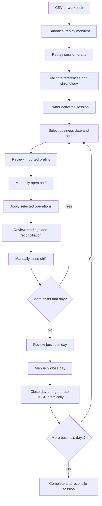
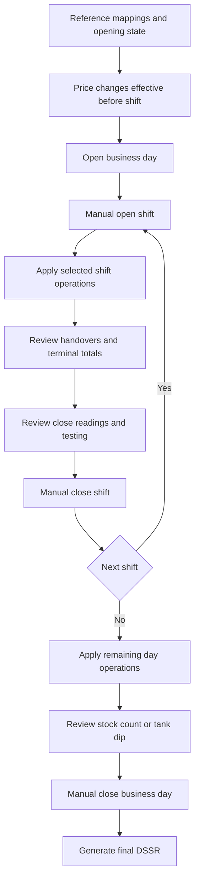

# Phase HR: Historical replay and manual day close

**Status:** Proposed for review

**Goal:** load a historical pump dataset as staged drafts, let an Owner or Manager select which operations to apply, prefill the normal shift UI, and manually close every shift and business day through the standard PumpOS domain workflows.

This phase is intended first for regression testing with one month of real, anonymized station data. It must not become a shortcut that inserts rows directly into operational tables.

---

## Decision summary

The requested workflow is feasible with these boundaries:

1. The first release runs only against an isolated test organization or a test station with no later operational data.
2. The replay runs strictly from the oldest business date to the newest.
3. Imported records remain drafts until the user applies them.
4. Every applied operation goes through the same core use-case, event publication, stock movement, ledger posting, and authorization path used by normal API requests.
5. Opening and closing a shift remain manual confirmation actions.
6. Closing a business day remains a manual Owner or Manager action.
7. Business-day close and DSSR generation become one server transaction.
8. A closed shift or business day is a write barrier. This phase does not add historical reopen.

Replay into a live station that already contains later shifts, purchases, stock counts, or cost movements is out of scope for the first release. That requires full as-of inventory and cost accounting support.

---

## Why staging is required

The import file cannot write directly to `shifts`, `expenses`, `collections`, `stock_movements`, ledger tables, summaries, or DSSR snapshots.

Direct writes would bypass:

- domain validation
- tenant and station authorization
- business events
- drawer reconciliation
- stock movement generation
- customer and supplier ledgers
- financial account postings
- shift summaries
- idempotency
- immutable DSSR generation

The replay API therefore has two layers:

1. A control layer stores imported source data, mappings, validation results, selection state, and execution results.
2. An execution layer applies one selected operation at a time through shared application command handlers.



---

## First-release operating boundary

The historical replay MVP accepts a session only when all of these conditions pass:

- The session targets one organization and one station.
- The period is no longer than 31 business dates.
- No future business date is present.
- The station has no open shift when the session activates.
- The target date range has no unrelated operational records.
- The station has no later shift, stock movement, purchase, or stock count after the replay start date.
- The session contains a complete chronological sequence for the imported period.
- Opening balances and starting nozzle readings are available.
- All personal data has been anonymized before upload.

This restriction keeps current weighted-average cost and stock calculations correct because the system receives purchases, sales, and variances in their original order.

The replay should run in a maintenance window. It cannot run while the same station is processing a live shift because PumpOS permits only one open shift per station.

---

## User workflow

### 1. Create a replay session

The Owner selects:

- test station
- period start and end
- source label
- default timezone from station settings
- source file or canonical JSON manifest

The UI calculates a SHA-256 hash before upload. PumpOS stores the source name and hash, not the original file, unless a later privacy review approves raw-file storage.

### 2. Map source references

The user maps stable source codes to PumpOS entities:

- shift templates
- users and attendants
- dispenser units
- nozzles
- payment terminals
- products
- tanks
- customers and vehicles
- suppliers
- expense and income categories
- financial accounts

Unresolved references block activation.

### 3. Validate the full period

Validation returns errors and warnings by business date, shift, and source row.

Errors block activation. Warnings require review but can be accepted. A cash variance is normally a warning because the replay is expected to expose historical variances rather than hide them.

### 4. Activate the session

Activation freezes:

- manifest schema version
- source hash
- manifest hash
- reference mappings
- source payloads
- operation order and dependencies

Applied data cannot be changed by replacing the manifest. Corrections require a new draft item before day close or an explicit adjustment after the replay period.

### 5. Process one business date

The selected-date workspace shows all imported shifts and day-level operations for that date.

For each shift:

1. Review imported opening values.
2. Manually confirm Open shift.
3. Select operation types or individual items to apply.
4. Apply the selected items in source sequence.
5. Review handovers, nozzle readings, testing volume, closing cash, and warnings.
6. Manually confirm Close shift.

After the final shift:

1. Apply or skip remaining business-day-only items.
2. Review stock count and tank dip data when present.
3. Confirm that no required replay item remains unresolved.
4. Manually confirm Close business day.
5. The server closes the day and generates the final DSSR in one transaction.

### 6. Complete the session

A session can complete only when every business date is closed and every required item is either applied or explicitly skipped where skipping is allowed.

The completion report compares imported source totals with PumpOS results.

---

## What is selectable and what stays manual

| Item                            |    Imported as draft | User can select or exclude |           Manual confirmation required |    Created by domain side effects |
| ------------------------------- | -------------------: | -------------------------: | -------------------------------------: | --------------------------------: |
| Fuel price change               |                  Yes |                        Yes |                                     No |                                No |
| Open business day               | Synthetic dependency |                         No |                   No separate ceremony |                                No |
| Open shift                      |                  Yes |                         No |                                    Yes |                                No |
| Merchandise sale                |                  Yes |                        Yes |                                     No |                                No |
| Attendant handover              |                  Yes |                        Yes |                        Review required |                                No |
| Credit sale                     |                  Yes |                        Yes |                                     No |                                No |
| OMC fleet-card sale             |                  Yes |                        Yes |                                     No |                                No |
| Collection                      |                  Yes |                        Yes |                                     No |                                No |
| Expense                         |                  Yes |                        Yes |                                     No |                                No |
| Other income                    |                  Yes |                        Yes |                                     No |                                No |
| Purchase                        |                  Yes |                        Yes |                                     No |                                No |
| Supplier payment                |                  Yes |                        Yes |                                     No |                                No |
| Closing nozzle readings         |                  Yes |                         No |             Submitted with shift close |                                No |
| Testing volume                  |                  Yes |                         No | Submitted with shift close or handover |                                No |
| Closing cash                    |                  Yes |                         No |             Submitted with shift close |                                No |
| Tank dip or stock count         |                  Yes |                        Yes |                        Review required |                                No |
| Close shift                     |                  Yes |                         No |                                    Yes |                                No |
| Close business day              |                  Yes |                         No |                                    Yes |                                No |
| Fuel sale                       |                   No |                         No |                                     No | Yes, derived from nozzle readings |
| Fuel stock movement             |                   No |                         No |                                     No |       Yes, created by shift close |
| Customer or supplier ledger row |                   No |                         No |                                     No |                               Yes |
| Financial account posting       |                   No |                         No |                                     No |                               Yes |
| Shift summary                   |                   No |                         No |                                     No |                               Yes |
| Business event                  |                   No |                         No |                                     No |                               Yes |
| DSSR snapshot                   |                   No |                         No |                                     No |         Yes, created by day close |

Required lifecycle items cannot be skipped. Optional imported operations can be skipped only with a reason.

---

## Operation order

The server compiles the manifest into a dependency graph. Sequence numbers are explicit and stable.



Purchases and other stock-affecting operations must preserve their source position relative to shifts and stock counts. The next replay day depends on successful closure of the prior day.

---

## Data model

Three control tables are proposed. They hold replay state only. Canonical business records remain in existing tables.

### `historical_replay_sessions`

Suggested columns:

```text
id uuid primary key
organization_id uuid not null
station_id uuid not null
period_from varchar(10) not null
period_to varchar(10) not null
status varchar not null
schema_version integer not null
source_name varchar
source_sha256 varchar not null
manifest_sha256 varchar
reference_map jsonb not null
validation_summary jsonb
created_by uuid not null
validated_by uuid
activated_by uuid
completed_by uuid
created_at timestamp not null
validated_at timestamp
activated_at timestamp
completed_at timestamp
updated_at timestamp not null
row_version integer not null
```

Session status:

```text
DRAFT
VALIDATED
ACTIVE
COMPLETED
CANCELLED
```

Indexes:

- `(organization_id, station_id, status)`
- `(organization_id, station_id, period_from, period_to)`
- unique source hash per station may be added after pilot feedback

### `historical_replay_items`

Suggested columns:

```text
id uuid primary key
session_id uuid not null
organization_id uuid not null
station_id uuid not null
source_key varchar not null
operation_type varchar not null
scope varchar not null
business_date varchar(10) not null
shift_key varchar
sequence integer not null
effective_at timestamp not null
required boolean not null
selected boolean not null
status varchar not null
source_payload jsonb not null
working_payload jsonb not null
payload_sha256 varchar not null
validation_issues jsonb
skip_reason varchar
domain_entity_type varchar
domain_entity_id uuid
result jsonb
error jsonb
attempt_count integer not null
reviewed_by uuid
reviewed_at timestamp
applied_by uuid
applied_at timestamp
created_at timestamp not null
updated_at timestamp not null
```

Item status:

```text
DRAFT
BLOCKED
READY
APPLIED
SKIPPED
FAILED
```

Constraints and indexes:

- unique `(session_id, source_key)`
- unique `(session_id, sequence)`
- index `(session_id, business_date, sequence)`
- index `(session_id, status, sequence)`
- index `(organization_id, station_id, business_date)`

`source_payload` never changes. User edits update `working_payload`, which preserves the imported value for comparison.

### `historical_replay_dependencies`

Suggested columns:

```text
item_id uuid not null
depends_on_item_id uuid not null
primary key (item_id, depends_on_item_id)
```

This table supports dependency checks, cycle detection, and ready-item queries without searching JSON arrays.

### RLS and Data API exposure

- Enable RLS on all three tables.
- Scope every policy by trusted organization membership and station access.
- Do not authorize through user-editable `user_metadata`.
- Do not grant `anon` or `authenticated` direct Data API access to replay tables. The Hono API is the only client entry point.
- Index the columns used by RLS membership and tenant predicates.

Supabase no longer guarantees that new public tables are automatically exposed through the Data API. This plan does not depend on Data API exposure.

---

## Canonical manifest

The API accepts a versioned JSON manifest. CSV and workbook templates are client-side authoring formats that compile into this manifest.

```json
{
  "schemaVersion": 1,
  "stationId": "station-uuid",
  "period": {
    "from": "2026-07-01",
    "to": "2026-07-31"
  },
  "source": {
    "name": "July 2026 regression dataset",
    "sha256": "source-file-sha256"
  },
  "references": {
    "shiftTemplates": {
      "morning": "template-uuid",
      "evening": "template-uuid",
      "night": "template-uuid"
    },
    "users": {
      "attendant-a": "user-uuid"
    },
    "nozzles": {
      "ms-1": "nozzle-uuid"
    },
    "products": {
      "ms": "product-uuid"
    },
    "tanks": {
      "ms-main": "tank-uuid"
    }
  },
  "operations": [
    {
      "key": "2026-07-01:morning:open",
      "type": "OPEN_SHIFT",
      "scope": "SHIFT",
      "businessDate": "2026-07-01",
      "shiftKey": "2026-07-01:morning",
      "sequence": 1100,
      "effectiveAt": "2026-07-01T06:00:00+05:30",
      "required": true,
      "payload": {
        "shiftTemplateRef": "morning",
        "openingCash": 5000,
        "staffAssignments": [
          {
            "userRef": "attendant-a",
            "duRef": "du-1"
          }
        ],
        "initialReadings": [
          {
            "nozzleRef": "ms-1",
            "openingReading": 120045.3
          }
        ]
      }
    },
    {
      "key": "2026-07-01:morning:expense:001",
      "type": "RECORD_EXPENSE",
      "scope": "SHIFT",
      "businessDate": "2026-07-01",
      "shiftKey": "2026-07-01:morning",
      "sequence": 1210,
      "effectiveAt": "2026-07-01T09:10:00+05:30",
      "required": false,
      "payload": {
        "categoryRef": "tea",
        "amount": 240,
        "paymentSource": "SHIFT_CASH",
        "notes": "Imported source row 18"
      }
    },
    {
      "key": "2026-07-01:morning:close",
      "type": "CLOSE_SHIFT",
      "scope": "SHIFT",
      "businessDate": "2026-07-01",
      "shiftKey": "2026-07-01:morning",
      "sequence": 1900,
      "effectiveAt": "2026-07-01T14:00:00+05:30",
      "required": true,
      "executionMode": "MANUAL",
      "payload": {
        "closingCash": 15840,
        "nozzleReadings": [
          {
            "nozzleRef": "ms-1",
            "closingReading": 120845.7,
            "testingVolume": 5
          }
        ]
      }
    },
    {
      "key": "2026-07-01:day:close",
      "type": "CLOSE_BUSINESS_DAY",
      "scope": "DAY",
      "businessDate": "2026-07-01",
      "sequence": 1999,
      "effectiveAt": "2026-07-02T05:59:00+05:30",
      "required": true,
      "executionMode": "MANUAL",
      "payload": {}
    }
  ]
}
```

The manifest must use source keys and logical references. It must not depend on client-generated domain entity IDs.

---

## Operation registry

The replay executor uses an allowlisted registry. Unknown operation types fail validation.

| Replay operation              | Core or application path                          | Notes                                              |
| ----------------------------- | ------------------------------------------------- | -------------------------------------------------- |
| `SET_FUEL_PRICE`              | `RecordFuelPrice`                                 | Must resolve price effective at shift time         |
| `OPEN_SHIFT`                  | `OpenShift`                                       | Manual confirmation, creates or reuses an OPEN day |
| `RECORD_MERCHANDISE_SALE`     | `CreateSale`                                      | Non-fuel products only                             |
| `RECORD_MERCHANDISE_HANDOVER` | `RecordMerchandiseHandover`                       | Freeze imported unit prices                        |
| `RECORD_CREDIT_SALE`          | `RecordCreditSale`                                | No second fuel stock movement                      |
| `RECORD_OMC_CARD_SALE`        | `RecordOmcCardSale` plus CMS ledger posting       | Include in DSSR                                    |
| `RECORD_COLLECTION`           | `RecordCollection` plus money ledger posting      | Shift only for cash drawer collection              |
| `RECORD_EXPENSE`              | `RecordExpense` plus money ledger posting         | Shift only for `SHIFT_CASH`                        |
| `RECORD_INCOME`               | `RecordIncome` plus money ledger posting          | Shift only when cash enters drawer                 |
| `RECORD_PURCHASE`             | `RecordPurchase`                                  | Business-day anchored, no shift                    |
| `RECORD_SUPPLIER_PAYMENT`     | `RecordSupplierPayment` plus money ledger posting | Shift only for drawer cash                         |
| `RECORD_ATTENDANT_HANDOVER`   | New core use-case                                 | Required before replay handovers                   |
| `RECORD_STOCK_COUNT`          | `RecordStockCount`                                | Must accept target business day                    |
| `CLOSE_SHIFT`                 | `CloseShift` plus shift-close ledger posting      | Manual confirmation and idempotent effects         |
| `CLOSE_BUSINESS_DAY`          | New atomic close-day application command          | Manual confirmation and final DSSR                 |

The executor must call shared application command handlers, not HTTP routes and not bare core use-cases where the live route has extra ledger or account-posting behavior.

Suggested application layer:

```text
apps/api/src/application/commands/
  open-shift.ts
  close-shift.ts
  record-collection.ts
  record-expense.ts
  record-income.ts
  record-purchase.ts
  record-supplier-payment.ts
  record-credit-sale.ts
  record-omc-sale.ts
  close-business-day.ts
```

Live routes and replay routes should call the same handlers.

---

## API design

All responses keep the PumpOS envelope:

```json
{
  "success": true,
  "data": {}
}
```

Errors use:

```json
{
  "success": false,
  "error": {
    "code": "REPLAY_DEPENDENCY_BLOCKED",
    "message": "The prior shift has not been closed",
    "details": {}
  }
}
```

### Session endpoints

```text
POST   /api/historical-replays
GET    /api/historical-replays/:sessionId
PATCH  /api/historical-replays/:sessionId
PUT    /api/historical-replays/:sessionId/manifest
POST   /api/historical-replays/:sessionId/validate
POST   /api/historical-replays/:sessionId/activate
POST   /api/historical-replays/:sessionId/complete
POST   /api/historical-replays/:sessionId/cancel
```

Rules:

- Only a DRAFT session can replace its manifest.
- Only a successfully validated session can activate.
- Activation freezes hashes, source payloads, mappings, order, and dependencies.
- Cancelling a session does not delete already applied domain records.
- Completing a session is allowed only after all included days close.

### Item and selection endpoints

```text
GET    /api/historical-replays/:sessionId/items
GET    /api/historical-replays/:sessionId/items/:itemId
PATCH  /api/historical-replays/:sessionId/items/:itemId
POST   /api/historical-replays/:sessionId/items/:itemId/apply
POST   /api/historical-replays/:sessionId/items/:itemId/skip
POST   /api/historical-replays/:sessionId/apply-selected
```

Useful item filters:

```text
businessDate
shiftKey
operationType
status
selected
limit
cursor
```

`PATCH item` can change only:

- `selected`
- unresolved reference choices
- editable fields in `working_payload`
- review notes

It cannot change `source_payload`, source key, sequence, business date, or an APPLIED item.

### Apply one item

```http
POST /api/historical-replays/{sessionId}/items/{itemId}/apply
Idempotency-Key: replay:{sessionId}:{sourceKey}
```

Execution steps:

1. Start a database transaction.
2. Lock the replay item row.
3. Return the stored result if status is APPLIED.
4. Verify session status, tenant, station, payload hash, selection state, and dependencies.
5. Resolve logical references server-side.
6. Build a replay execution context.
7. Run the shared application command handler.
8. Publish normal business events in the same transaction.
9. Run required stock and ledger side effects in the same transaction.
10. Mark the replay item APPLIED with result entity IDs.
11. Commit.

A failed domain command rolls back all domain effects. The item records a sanitized failure after rollback.

### Apply selected items

```json
{
  "businessDate": "2026-07-01",
  "shiftKey": "2026-07-01:morning",
  "operationTypes": ["RECORD_EXPENSE", "RECORD_COLLECTION"],
  "itemIds": [],
  "limit": 25,
  "stopOnError": true
}
```

Rules:

- Process items by sequence.
- Use one transaction per item.
- Never include manual lifecycle items.
- Default batch limit is 25, hard maximum 50.
- Stop on the first error by default because later items may depend on the failed item.
- Return applied, failed, blocked, and remaining counts.
- Repeating the request returns stored successes and continues with the next ready item.

The UI may call this endpoint repeatedly until no selected READY item remains. A month-wide transaction or one month-wide HTTP request is prohibited.

### Day workspace endpoints

```text
GET /api/business-days?stationId=:id&from=:date&to=:date
GET /api/business-days/by-date?stationId=:id&date=:date
GET /api/business-days/:businessDayId/workspace
POST /api/business-days/:businessDayId/close
```

The workspace response should include:

- business-day status
- replay session and day progress
- shifts for that day
- shift summaries
- open shift, if any
- selected and unresolved replay items
- provisional DSSR preview
- close blockers and warnings
- previous and next imported business dates

---

## Replay execution context

Historical occurrence time and actual recording time must remain distinct.

Current `ExecutionContext.clock` drives both domain timestamps and event recording timestamps. Replacing it with a historical fixed clock would falsely claim that PumpOS persisted the event in the past.

Add an optional effective time to the execution context:

```ts
interface ExecutionContext {
  // existing fields
  effectiveAt?: Date | null;
  metadata?: Record<string, unknown>;
}
```

Rules:

- `clock.now()` remains the real system time.
- `effectiveAt` records when the source operation happened.
- Shift `openedAt` and `closedAt` use `effectiveAt` during replay.
- Entity `createdAt` and replay audit fields use the real system time unless the field explicitly means business occurrence time.
- `eventFromContext` defaults `occurredAt` to `effectiveAt` and `recordedAt` to `clock.now()`.
- `actorId` remains the authenticated user applying the replay.
- Historical attendant or operator identity stays in operation fields and event metadata. The replay must not impersonate a historical user.

Event metadata:

```json
{
  "historicalReplaySessionId": "uuid",
  "historicalReplayItemId": "uuid",
  "sourceKey": "2026-07-01:morning:expense:001",
  "manifestSha256": "hash",
  "historicalOperatorId": "uuid-or-null"
}
```

Use the replay session ID as the event `correlationId`.

---

## Historical business-day close

Historical day close is feasible and should become a first-class date-scoped workflow.

### Current problems

The current frontend generates a DSSR and then closes the day in separate requests. This can persist a snapshot whose status is OPEN. It can also leave a closed day with a stale snapshot if more activity occurred after an earlier report generation.

The current core close use-case does not verify open shifts or missing shift summaries.

### Proposed atomic command

Add an application command such as `CloseBusinessDayAndGenerateDssr`.

Input:

```ts
interface CloseBusinessDayInput {
  businessDayId: string;
  replaySessionId?: string;
  effectiveAt?: string;
  confirmationToken?: string;
}
```

Server checks:

1. The day belongs to the authenticated organization and station.
2. The user has Owner or Manager permission and station access.
3. The day status is OPEN.
4. No shift belonging to the day is OPEN.
5. Every CLOSED or LOCKED shift has exactly one shift summary.
6. No required replay item for the day is DRAFT, BLOCKED, READY, or FAILED.
7. Required lifecycle items were not skipped.
8. A DSSR snapshot does not already exist unless this request is an idempotent retry of the same close command.
9. Optional warnings have been acknowledged.

One transaction then:

1. Marks the business day CLOSED.
2. Publishes `BUSINESS_DAY_CLOSED`.
3. Reads the now-closed day data.
4. Generates and saves the immutable DSSR.
5. Publishes `DSSR_GENERATED`.
6. Marks the replay close item APPLIED when present.
7. Returns `{ businessDay, dssr, warnings }`.

Do not expose `force` DSSR regeneration as a normal UI action. Open-day report screens should use an in-memory preview and must not persist a snapshot.

### Closed-day policy

After close:

- no new shift can attach to the day
- no transaction can attach to the day
- no replay item can apply to the day
- no DSSR can regenerate through the normal endpoint
- corrections use a new adjustment in an open business day

Historical reopen is explicitly out of scope for this phase.

---

## Core and data fixes required before replay

### HR0.1 Open historical days correctly

`ensureBusinessDayForDate` currently creates past dates as CLOSED. Change it to create any lazily resolved date as OPEN, including past dates. A past day stays open until an authorized explicit close.

This matches the project rule that multiple dates may remain open and close independently.

### HR0.2 Enforce closed-day and closed-shift write barriers

- `OpenShift` must reject an existing CLOSED business day.
- Every business-day write must reject a CLOSED business day.
- Every shift-linked write must require shift status OPEN, not merely reject LOCKED.
- A closed day cannot reopen through replay.

### HR0.3 Resolve fuel prices as of shift time

Replace newest-price selection with:

```text
station + product
effective_from <= shift effective time
ORDER BY effective_from DESC
LIMIT 1
```

Add a repository port such as `findEffectiveAt` or `latestByProductsAt`.

### HR0.4 Resolve prior nozzle readings by operational chronology

Do not use reading `createdAt` as the continuity rule.

Resolve the prior reading by:

- station
- nozzle
- business date
- shift effective opening time
- prior closed shift sequence

Validate that imported opening reading equals the prior closing reading unless the item declares a meter replacement or rollover reason.

### HR0.5 Move attendant handover into core

The existing handover route writes tables and nozzle readings directly. Add a transactional core use-case that:

- requires an OPEN shift
- validates attendant, DU, terminal, and nozzle ownership
- validates terminal totals
- validates testing and closing readings
- creates or replaces one draft handover safely
- publishes `HANDOVER_RECORDED`

### HR0.6 Extract shared application command handlers

Replay must include the same ledger posting and route-level orchestration as live commands. Move that orchestration out of route bodies so both callers share it.

### HR0.7 Make shift close idempotent

Reopen and re-close must not duplicate reading-derived fuel stock movements or financial postings.

Use stable posting keys and database uniqueness. Close should replace or reuse prior close-generated effects for the same shift.

### HR0.8 Add lifecycle uniqueness constraints

Add or verify:

```text
one OPEN shift per organization and station
unique nozzle reading per shift and nozzle
unique shift summary per shift
unique DSSR per organization, station, and business date
unique attendant handover per shift, user, and DU
stable posting key for close-generated stock and ledger rows
```

The partial OPEN-shift unique index protects against concurrent opens, not just normal sequential requests.

### HR0.9 Make stock counts date-aware

`RecordStockCount` must accept a target `businessDayId` or transaction date and anchor its variance movement to that day.

The first replay release still requires chronological processing so the current stock total represents the source point in time.

### HR0.10 Freeze report inputs at close

- Generate each DSSR immediately when that business day closes.
- Ensure OMC sales appear in DSSR composition.
- Store historical merchandise unit prices from the replay item rather than reading the current product selling price.
- Preserve cost inputs needed for the immutable snapshot.

### HR0.11 Harden HTTP idempotency

Current idempotency keys are globally unique even though middleware looks them up by organization.

Change the model to:

- unique `(organization_id, idempotency_key)`
- store method, path, request hash, state, and expiry
- reject reuse with a different request hash
- recover expired in-progress reservations

Replay item identity remains the primary guarantee. HTTP idempotency protects network retries.

---

## UI plan

### Selected-date shift workspace

Keep the existing Shifts page and add one compact date context above its current content.

```text
Previous | 18 Aug 2026 | Next | Today
Day open | Imported session active | 2 of 3 shifts closed | 9 of 11 items applied
```

The date context drives:

- business-day workspace query
- shift list
- imported draft list
- Open Shift form defaults
- quick-entry transaction date defaults
- DSSR preview
- Close business day action

The station timezone and `business_day_starts_at` define date limits. Do not use UTC `toISOString()` for the date field maximum.

### Shift table

Use a dense table rather than more dashboard cards.

| Shift   | Import  | Meter review | Operations | Lifecycle  | Action  |
| ------- | ------- | ------------ | ---------- | ---------- | ------- |
| Morning | Ready   | 6 of 6 valid | 4 selected | Not opened | Review  |
| Evening | Applied | Valid        | 5 applied  | Closed     | Summary |
| Night   | Blocked | 1 mismatch   | 2 blocked  | Draft      | Resolve |

Selecting a row opens a right-side review drawer.

### Review drawer

Sections:

1. Shift template and imported source times
2. Opening cash and opening readings
3. Staff, DU, and terminal mappings
4. Selectable operation checklist
5. Closing readings, testing volume, and meter warnings
6. Closing cash and drawer reconciliation
7. Imported value versus edited working value
8. Validation errors, warnings, and skip reasons

Primary action depends on lifecycle:

- `Open shift`
- `Apply selected`
- `Review and close shift`
- `View summary`

### Historical day close

The selected historical date has the same Business Day tab as today.

Show:

- OPEN or CLOSED status
- all shifts belonging to that date
- unresolved replay item count
- provisional DSSR preview
- close blockers
- warning acknowledgements
- one `Close business day` primary action

The action is disabled when any hard blocker exists. The server repeats every check.

### UI states

Required states:

- loading
- empty date
- draft session
- validation blocked
- ready
- applying selected items
- partial success
- failed item
- skipped item
- open shift
- close blocked
- day closed
- offline or sync pending
- permission restricted

Replay apply and lifecycle close should require a live connection in the first release. The replay control state is not part of the desktop offline outbox.

---

## Query caching

Replay and day workspace data are operational. Use the existing operational tier and do not persist these queries.

Add centralized keys:

```ts
businessDays(stationId, from, to);
businessDayWorkspace(stationId, businessDate);
historicalReplay(sessionId);
historicalReplayItems(sessionId, filters);
historicalReplayDay(sessionId, businessDate);
```

Mutation invalidation:

- Item edit or skip invalidates replay session, replay items, and selected day workspace.
- Apply operation invalidates the day workspace and affected shift, inventory, customer, supplier, ledger, and report keys.
- Open or close shift invalidates shift status, day workspace, shift summaries, inventory, and DSSR preview.
- Close business day invalidates business-day range, selected workspace, DSSR, DSSR preview, DSSR range, and report keys.

Do not call replay services directly from component bodies. Use TanStack Query hooks or `ensureQueryData` with centralized keys.

---

## Validation rules

### Manifest validation

- Schema version is supported.
- Period is valid and no longer than 31 dates.
- Every source key and sequence is unique.
- Dependency graph is acyclic.
- Effective times are chronological for each station aggregate.
- Business date matches `resolveBusinessDate` for station timezone and day-start settings.
- No future date exists.
- Every replay day has required lifecycle items.
- Every shift has open and close drafts.
- Next shift depends on prior shift close.
- Next day depends on prior day close.
- No item appears after its shift or day close.
- Fuel volume comes from nozzle readings, never a manual fuel sale.
- Drawer cash operations have a shift.
- Card, UPI, bank, owner, purchases, and credit receivables do not enter drawer reconciliation.
- Closing reading is not below opening reading unless an explicit meter replacement rule applies.
- Testing volume does not exceed gross meter movement.
- Purchase tank allocations equal line quantity.
- Required lifecycle items cannot be excluded.

### Database preflight

- Every referenced entity belongs to the authenticated organization.
- Station-scoped references belong to the session station.
- Nozzle, tank, product, and DU relationships agree.
- User and terminal assignments are valid.
- Fuel price exists as of every shift opening time.
- No conflicting business rows exist in the target period.
- No later operational rows make chronological insertion unsafe.
- Opening nozzle and stock state reconcile with the first imported day.
- Simulated nozzle continuity passes across all 90 shifts.
- Customer, supplier, and financial opening balances are present when needed.

### Close shift checks

- Exact expected nozzle set is present.
- No duplicate or unknown nozzle exists.
- Closing and testing values are valid.
- Handovers are complete or explicitly waived with a reason.
- Terminal totals reconcile.
- Selected operations for the shift are APPLIED or SKIPPED.
- Closing cash and variance are displayed before confirmation.

### Close day checks

- No shift for the day is OPEN.
- Every shift has one immutable summary.
- Required replay items are resolved.
- Stock count and dip review is complete when supplied.
- DSSR does not already exist from an open-day generation.
- Warnings have user acknowledgement.

---

## Permissions

Initial role policy:

| Action                         | Owner | Manager |                                       Accountant | Staff |
| ------------------------------ | ----: | ------: | -----------------------------------------------: | ----: |
| Create and upload session      |   Yes |      No |                                               No |    No |
| Validate session               |   Yes |     Yes |                                        View only |    No |
| Activate or cancel session     |   Yes |      No |                                               No |    No |
| Edit mappings and draft values |   Yes |     Yes |                                        View only |    No |
| Apply selected operations      |   Yes |     Yes | Permitted non-drawer items only in a later phase |    No |
| Open or close historical shift |   Yes |     Yes |                                               No |    No |
| Close historical business day  |   Yes |     Yes |                                               No |    No |
| View replay audit              |   Yes |     Yes |                                              Yes |    No |

Every endpoint derives organization identity from the authenticated user. Payload organization IDs are ignored or rejected.

---

## Delivery plan

### HR0: correctness prerequisites

- [ ] Make historical business days OPEN until explicit close.
- [ ] Enforce closed-day and closed-shift write barriers.
- [ ] Add effective occurrence time separate from recording time.
- [ ] Add fuel price as-of lookup.
- [ ] Add chronological nozzle continuity lookup.
- [ ] Add core attendant-handover use-case and event.
- [ ] Make shift close effects idempotent.
- [ ] Add lifecycle uniqueness constraints.
- [ ] Make stock count target-date aware.
- [ ] Include OMC sales and frozen prices in reports.
- [ ] Harden organization-scoped HTTP idempotency.

### HR1: shared application command layer

- [ ] Extract transaction, ledger, stock, and event orchestration from live route bodies.
- [ ] Route existing live mutations through shared handlers.
- [ ] Add handler-level tests proving live and replay execution produce the same effects.

### HR2: replay schema and repositories

- [ ] Add session, item, and dependency tables.
- [ ] Add indexes and RLS policies.
- [ ] Add replay repositories in the API adapter layer.
- [ ] Add manifest hashing and source-payload immutability.

### HR3: validation and replay API

- [ ] Add versioned manifest schemas in `@pump/shared`.
- [ ] Add reference resolution and dependency compilation.
- [ ] Add manifest and database preflight validation.
- [ ] Add session lifecycle endpoints.
- [ ] Add item edit, selection, apply, skip, and bounded apply-selected endpoints.
- [ ] Add item-row locking and durable result reuse.

### HR4: date-scoped business-day API and close

- [ ] Add business-day list and by-date endpoints.
- [ ] Add the day workspace projection.
- [ ] Add atomic close-day plus DSSR command.
- [ ] Remove persistent open-day DSSR generation from normal report UI.
- [ ] Add close blockers and warning acknowledgements.

### HR5: replay UI

- [ ] Add session creation, mapping, validation, and activation screens.
- [ ] Add selected-date context to Shifts.
- [ ] Add dense imported shift table and review drawer.
- [ ] Prefill Open Shift, quick-entry, handover, and Close Shift forms.
- [ ] Add operation type and item selection.
- [ ] Add apply progress, failure, retry, and skip states.
- [ ] Add historical Business Day view and manual close action.
- [ ] Add centralized operational query hooks and invalidation.

### HR6: templates, pilot, and reconciliation

- [ ] Provide CSV or workbook templates for each operation family.
- [ ] Add client-side conversion to the canonical manifest.
- [ ] Add anonymization checklist and source hash display.
- [ ] Pilot one day with three shifts.
- [ ] Pilot seven days including price, purchase, credit, and variance cases.
- [ ] Run the full month of 90 shifts.
- [ ] Compare shift, daily, and monthly source totals.
- [ ] Document reset and rerun procedure for the isolated test station.

---

## Test plan

### Unit tests

- manifest schema and date validation
- dependency cycle detection
- source key and sequence uniqueness
- item selection and required-item rules
- replay effective time and event recorded time
- price effective at shift opening
- prior nozzle reading by operational order
- closed-day and closed-shift guards
- idempotent item apply
- idempotent shift close effects
- atomic day close and DSSR generation

### Integration tests

- duplicate apply returns stored result
- concurrent apply locks one replay item
- cross-tenant and cross-station references fail
- failure rolls back domain and ledger effects
- a prior failed item blocks dependent items
- apply-selected stops safely and resumes
- day close rejects an open shift
- day close rejects unresolved required items
- day close creates exactly one CLOSED DSSR
- closed day rejects all later writes

### Full-period acceptance

For a 30-day, three-shift dataset:

- exactly 30 business days exist
- exactly 90 shifts exist
- every shift has one summary
- every business day has one final DSSR
- every nozzle opening equals the previous closing, except approved meter events
- fuel stock reduction equals net metered volume by tank
- historical price changes apply to the correct shifts
- credit and OMC sales do not create duplicate fuel stock movement
- customer balance equals opening balance plus credit sales minus collections
- supplier balance equals opening balance plus purchases minus payments
- financial account movements match applied money operations
- drawer calculations match each imported source shift
- daily DSSR totals equal source daily totals
- monthly totals equal the sum of the 30 immutable DSSRs
- every applied item has domain result IDs and normal business events
- replaying the same item creates no duplicate effect

---

## Rollout and failure policy

1. Ship behind an environment feature flag.
2. Enable only in staging at first.
3. Restrict creation and activation to Owner.
4. Run one-day and seven-day pilots before a full month.
5. Keep a database snapshot or disposable Supabase branch before each pilot.
6. Stop on the first chronology, stock, or price error.
7. Do not delete applied business records through replay cancellation.
8. Reset the isolated test database or station between full regression runs until a formal reversal workflow exists.

No external notification, payment, messaging, or accounting integration should run during replay.

---

## Review decisions

The implementation should not start until these decisions are accepted:

1. **MVP target:** isolated regression station only. Recommended: accept.
2. **Input format:** canonical JSON API with CSV or workbook authoring templates. Recommended: accept.
3. **Lifecycle:** manual shift open, manual shift close, and manual business-day close. Recommended: accept.
4. **Permissions:** Owner activates; Owner or Manager executes and closes. Recommended: accept.
5. **Closed periods:** no reopen in this phase. Recommended: accept.
6. **Batch execution:** bounded synchronous batches with one transaction per item, not a month-wide background job. Recommended: accept for the first release.
7. **Raw source retention:** keep source name and hash only. Recommended: accept unless audit policy requires encrypted file retention.
8. **Production backfill:** defer until as-of stock and cost support exists. Recommended: accept.
